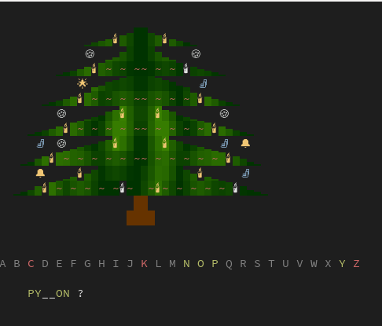

# first-shell

[](https://15r10nk.github.io/first-shell/)
[](https://pypi.org/project/first-shell/)


[](https://github.com/sponsors/15r10nk)

-----

Hi, I wrote the following shell for my 4 year old daughter, because she wants to do the same things like her dad. 


## Installation

```console
pip install first-shell
```

simpleaudio requires libasound:
``` console
apt-get install libasound2-dev
```

## Usage

Run first-shell with `first-shell`

It reads every character/word/line the user writes into the prompt.

Games:

- **xmas**: guess words and keep the lights on



## TODO

- [ ] testing
- [ ] i18n support
- [ ] custom config file with words
- [ ] more games & features


## License

`first-shell` is distributed under the terms of the [MIT](https://spdx.org/licenses/MIT.html) license.
